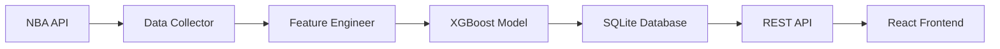

# NBA Game Predictions System

A comprehensive system for predicting NBA game quality using machine learning, featuring a RESTful API, automated data collection, and a modern web interface.

## 🏀 Overview

This system analyzes NBA games and predicts their entertainment value on a scale of 0-100, classifying them as "good", "mediocre", or "bad" based on factors like rivalry scores, competitive moments, lead changes, and team standings.

## 🔮 Machine Learning Model

The prediction engine uses an **XGBoost regression model** trained on historical NBA game data with sophisticated feature engineering:

### Key Features
- **Rivalry Score**: Calculated from 5 years of playoff history and close games between teams
- **Competitive Seconds**: Time duration when score margin was ≤5 points
- **Lead Changes**: Number of times the lead changed hands during the game
- **Position Score**: Team strength based on conference standings
- **Score Differential**: Final point difference between teams
- **Inter-Conference Games**: Games between Eastern and Western conferences
- **Rank Difference**: Difference in conference rankings between teams

### Model Architecture
- **Algorithm**: XGBoost Regressor with scikit-learn Pipeline
- **Preprocessing**: StandardScaler for numerical features, OneHotEncoder for categorical
- **Training Data**: 1201+ historical NBA games with comprehensive feature engineering
- **Output**: Game quality rating (0-100) with configurable classification thresholds

## 🏗️ System Architecture

### 📊 [NBA Predictions API](./nba-predictions-api/)
RESTful API built with **Node.js**, **Express**, and **TypeScript**

**Key Features:**
- Game predictions with configurable classification thresholds
- SQLite database with automated schema management
- Comprehensive validation and error handling
- Rate limiting and security middleware
- Full test coverage with Jest
- OpenAPI/Swagger documentation

**Endpoints:**
- `GET /api/v1/predictions` - List games with filtering and pagination
- `GET /api/v1/predictions/:game_id` - Get specific game prediction
- `GET /health` - System health check

### 🤖 [NBA Predictions Scheduled Job](./nba-predictions-scheduled-job/)
Automated data collection and prediction service built with **Python**

**Key Features:**
- Automated NBA API data collection with retry logic
- Real-time feature engineering and prediction generation
- Configurable logging and error handling
- Database backup and management
- Environment-based configuration with python-dotenv

**Workflow:**
1. Fetches completed games from NBA API
2. Collects detailed game statistics and play-by-play data
3. Engineers features using team standings and historical data
4. Generates predictions using the trained XGBoost model
5. Stores results in SQLite database with automated backups

### 🌐 [NBA Predictions Frontend](./nba-predictions-fe/)
Modern web application built with **React**, **TypeScript**, and **Vite**

**Key Features:**
- Responsive design with Tailwind CSS
- Date-based game filtering
- Real-time API integration with React Query
- State management with Zustand
- Classification-based game sorting (good → mediocre → bad)
- Interactive game cards with team logos and rating badges

**Tech Stack:**
- React 18 with TypeScript
- Vite for build tooling
- Tailwind CSS for styling
- React Query for data fetching
- Zustand for state management

## ⚙️ Configuration

### API Configuration
```env
# Prediction thresholds
GOOD_GAME_THRESHOLD=80      # Rating ≥ 80 = "good"
MEDIOCRE_GAME_THRESHOLD=60  # Rating 60-79 = "mediocre"
                            # Rating < 60 = "bad"

# Database
DB_PATH=./data/nba_predictions.db

# Server
PORT=3001
NODE_ENV=development
```

### Scheduled Job Configuration
```env
# Data collection
NBA_API_RATE_LIMIT_DELAY=1.0
NBA_API_RETRY_ATTEMPTS=3

# Logging
LOG_LEVEL=INFO
LOG_FILE_PATH=./logs/scheduler.log

# Database backup
BACKUP_ENABLED=true
BACKUP_PATH=./backups/
```

## 🚀 Quick Start

### Prerequisites
- Node.js 18+
- Python 3.13+
- SQLite

### 1. Start the API
```bash
cd nba-predictions-api
npm install
npm run dev
```

### 2. Run Data Collection (Optional)
```bash
cd nba-predictions-scheduled-job
pip install -r requirements.txt
python -m src.main --date 2025-02-08
```

### 3. Launch Frontend
```bash
cd nba-predictions-fe
npm install
npm run dev
```

### 4. Access the Application
- **Frontend**: http://localhost:5173
- **API**: http://localhost:3001
- **API Docs**: http://localhost:3001/api-docs

## 📈 Data Pipeline



## 🧪 Testing

All components include comprehensive test suites:

```bash
# API tests
cd nba-predictions-api && npm test

# Frontend tests  
cd nba-predictions-fe && npm test

# Scheduled job validation
cd nba-predictions-scheduled-job && python -m src.main --validate
```

## 📊 Classification System

Games are classified into three tiers based on predicted entertainment value:

| Classification | Rating Range | Description |
|---------------|--------------|-------------|
| **Good** 🟢 | 80-100 | Highly entertaining games with close scores, multiple lead changes, or high rivalry |
| **Mediocre** 🟡 | 60-79 | Moderately entertaining games with some competitive moments |
| **Bad** 🔴 | 0-59 | Less entertaining games, often blowouts with minimal competition |

## 🔧 Development

### Project Structure
```
nba-predictions/
├── nba-predictions-api/     # RESTful API service
├── nba-predictions-fe/      # React frontend application  
├── nba-predictions-scheduled-job/  # Python data collection service
└── README.md               # This file
```

### Key Technologies
- **Backend**: Node.js, Express, TypeScript, SQLite
- **Frontend**: React, TypeScript, Vite, Tailwind CSS
- **Data Collection**: Python, NBA API, pandas, numpy
- **Machine Learning**: XGBoost, scikit-learn
- **Testing**: Jest, React Testing Library
- **Documentation**: OpenAPI/Swagger

## 📝 License

This project is for educational and demonstration purposes.